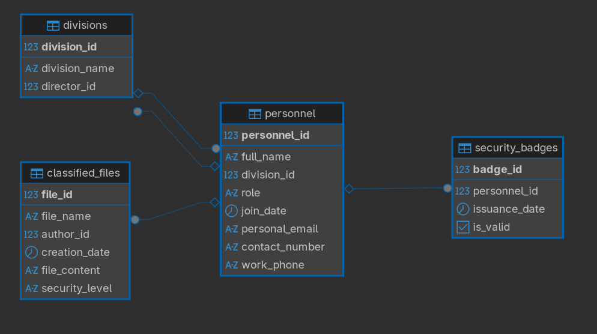
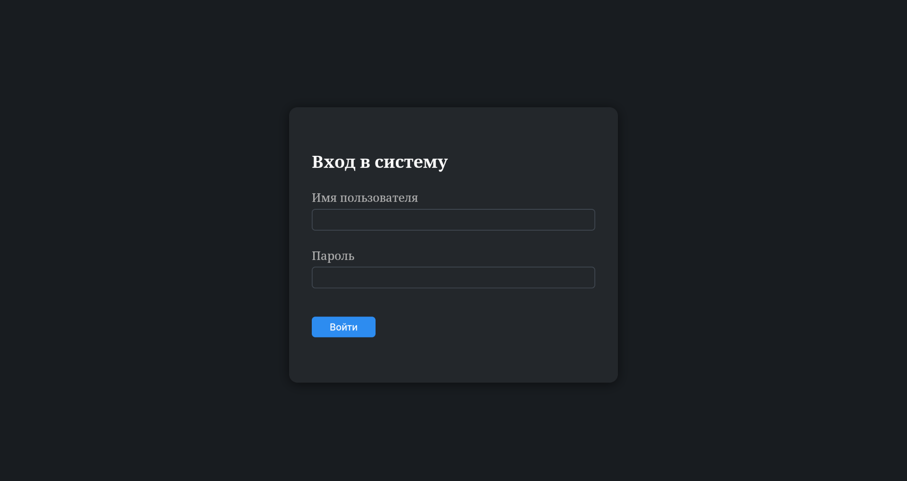
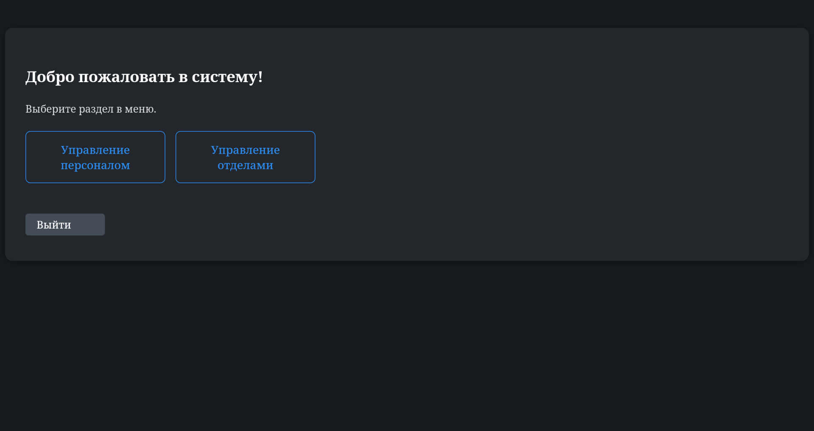
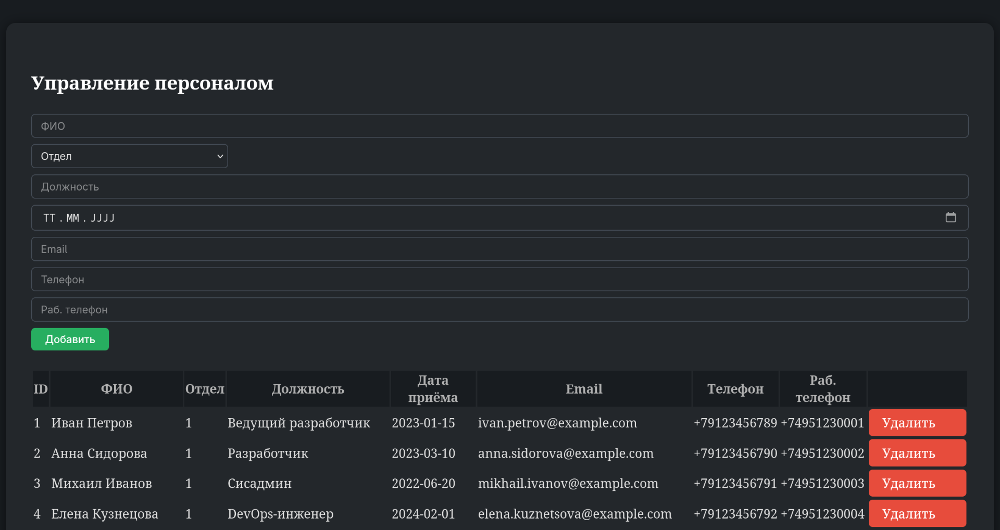
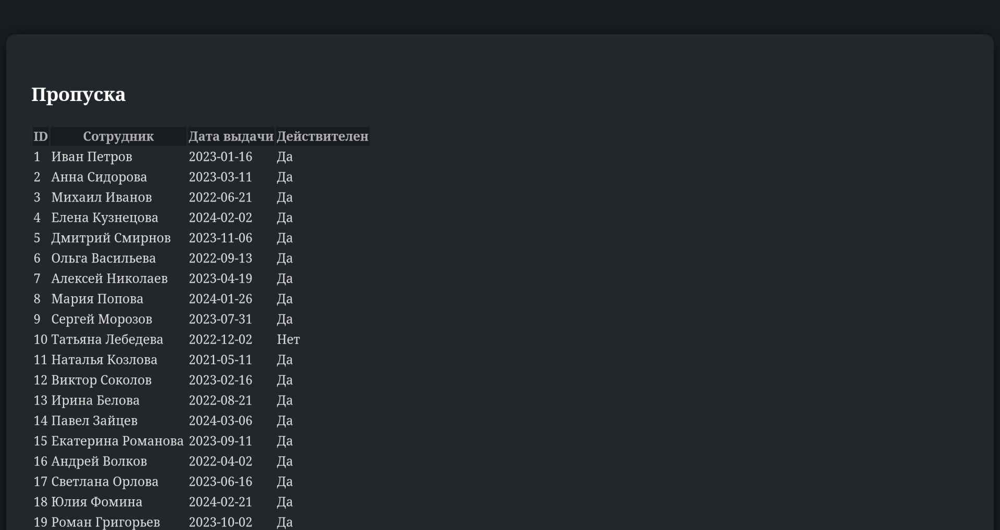
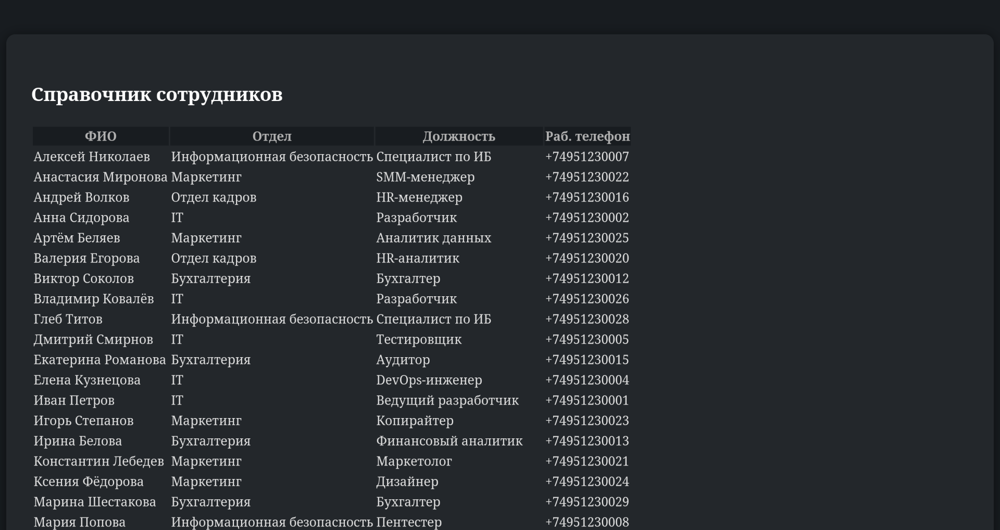
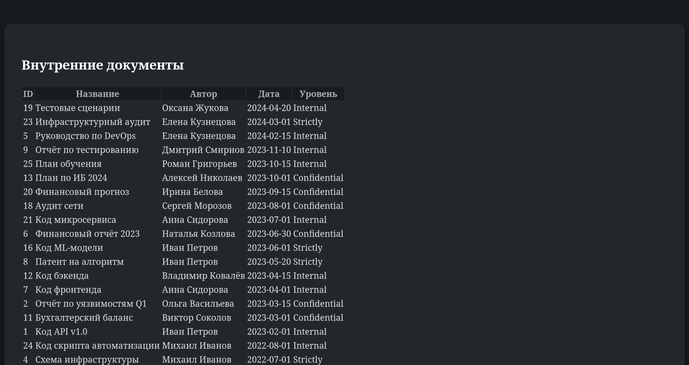

# Веб-интерфейс для администрирования HR/IB/Документов

## Описание

Это минималистичное Flask-приложение для работы с корпоративной базой данных (PostgreSQL): управление персоналом, отделами, пропусками, справочником сотрудников и внутренними документами. Интерфейс поддерживает разграничение ролей (HR-менеджер, сотрудник ИБ, обычный сотрудник).

## Возможности
- Аутентификация с ролями (HR, ИБ, сотрудник)
- CRUD для персонала и отделов (HR)
- Просмотр пропусков (ИБ)
- Просмотр справочника и документов (сотрудник)
- Современный тёмный интерфейс
- Flash-сообщения об ошибках и успехе

## Быстрый старт
1. Клонируйте репозиторий
2. Создайте и активируйте виртуальное окружение:
   ```bash
   python3 -m venv venv
   source venv/bin/activate
   ```
3. Установите зависимости:
   ```bash
   pip install -r requirements.txt
   ```
4. Настройте параметры подключения к БД в `config.py` или через переменные окружения
5. Запустите приложение:
   ```bash
   python app.py
   ```
6. Откройте в браузере http://localhost:5000

## Скриншоты


## ERD (диаграмма связей)

<div align="center">
   
</div>

## Скриншоты

<div align="center" style="display: flex; flex-wrap: wrap; gap: 24px; justify-content: center;">
   <div style="margin: 1rem; display: inline-block;">
      
      <br><sub>Окно входа</sub>
   </div>
   <div style="margin: 1rem; display: inline-block;">
      
      <br><sub>Главная страница (меню)</sub>
   </div>
   <div style="margin: 1rem; display: inline-block;">
      
      <br><sub>Управление персоналом</sub>
   </div>
   <div style="margin: 1rem; display: inline-block;">
      
      <br><sub>Управление отделами</sub>
   </div>
   <div style="margin: 1rem; display: inline-block;">
      
      <br><sub>Просмотр пропусков</sub>
   </div>
   <div style="margin: 1rem; display: inline-block;">
      
      <br><sub>Справочник сотрудников</sub>
   </div>
   <div style="margin: 1rem; display: inline-block;">
      
      <br><sub>Внутренние документы</sub>
   </div>
</div>

## Лицензия
Учебный проект. Не для коммерческого использования.
